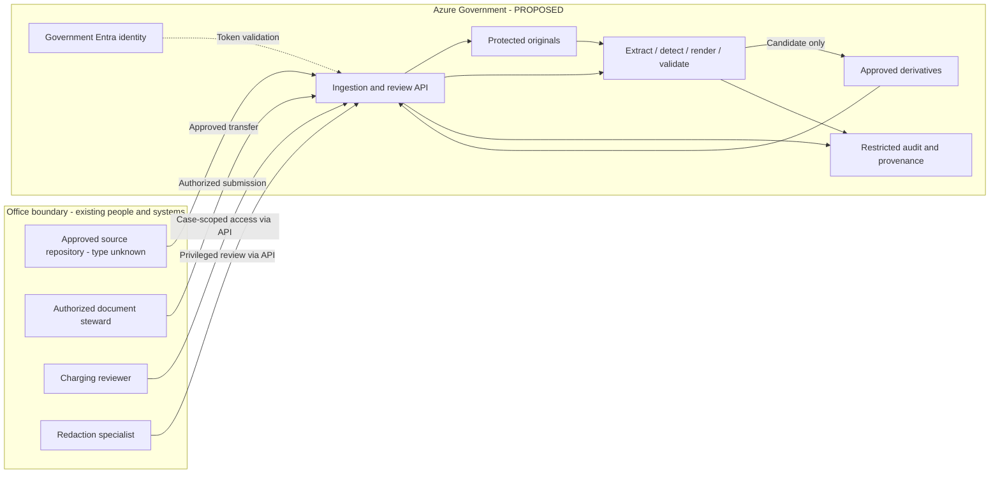
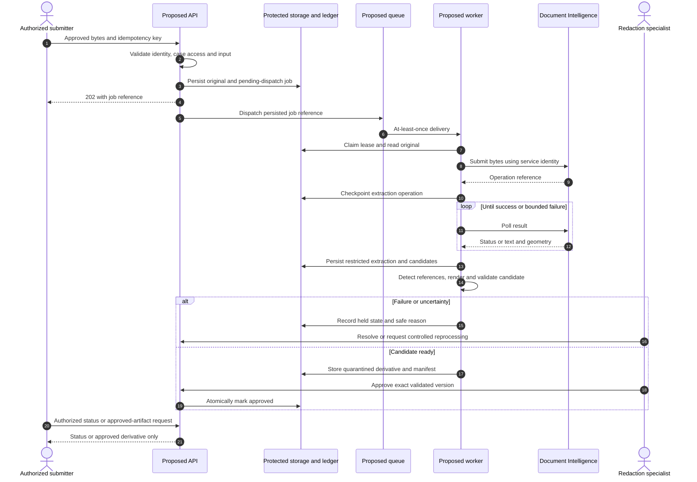
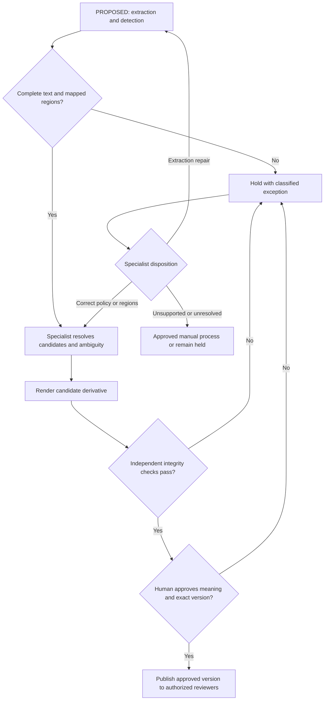
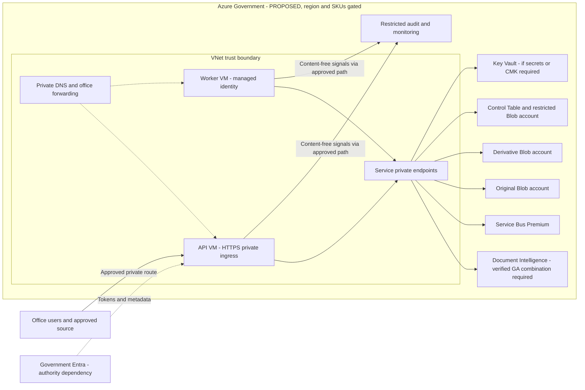

# Proposed reference architecture

Everything below is **proposed**, except the engagement facts stated in the [README](../README.md). Historical technology choices remain [open questions](open-questions.md). This is charging-review assistance, not legal decision automation.

## System context and trust boundaries

Standalone source: [system-context.mmd](../diagrams/system-context.mmd).

The office boundary has no implied source product or historical connector. All downloads pass application authorization. Charging reviewers receive only approved derivatives; redaction specialists may separately access originals for justified review. The diagram's derivative store contains quarantined candidates and approved versions under distinct access paths.

## Minimal components and responsibilities

| Proposed component | Responsibility |
| --- | --- |
| Ingestion/review API on Government VM | Authenticate caller, enforce case permissions, validate approved source, accept uploads, return job status, mediate artifact access and approval. |
| Service Bus Premium work queue | Carry opaque job references, not documents. Support asynchronous handoff; private endpoints require Premium [S9](sources.md#s9---service-bus-private-networking). |
| Worker on Government VM | Execute durable extraction/detection/render/validation stages with bounded concurrency and checkpoints. Logical stages need not each be microservices. |
| Document Intelligence | Extract text/layout and provenance using a verified GA model/API. Layout is a candidate, not the confirmed customer model [S6](sources.md#s6---extraction-and-page-geometry). |
| Local detection engine | Versioned approved rules/dictionaries; generate candidates and uncertainty. Optional NER is an evaluated alternative, not a baseline requirement. |
| PDF renderer and validator | Apply approved removals, sanitize output, validate independently, and keep candidate artifacts unavailable to charging reviewers. Library unselected. |
| Three storage accounts | Originals; derivatives; restricted control/provenance/audit. Control account uses Table for job ledger and Blob for sensitive intermediate artifacts. |
| Human-review interface through API | Resolve uncertain candidates, review integrity/meaning, approve exact artifact version or hold. No direct browser storage access in baseline. |
| Restricted monitoring; conditional Key Vault | Content-free operations and alerts; vault for required secrets/keys. Government-specific readiness gates apply to every component. |

No baseline LLM, AI Search, API Management, Kubernetes, or custom extraction training. Add them only for a demonstrated requirement. VM hosting reduces hosting-feature assumptions but creates patching, availability, scaling, and process-supervision obligations.

## Proposed API contract, not an implementation

An authorized `POST /documents` accepts approved document bytes plus opaque case/source-version references and an idempotency key. Reject unsupported or unsafe input explicitly. A successful durable acceptance returns `202 Accepted` with an opaque job ID and a status location; **accepted does not mean redacted or approved**.

`GET /jobs/{id}` returns only case-authorized status and safe error categories. Artifact retrieval and approval are separate operations with separate permissions. Reference formats and paths are illustrative; no service code is supplied.

Validate tenant, case access, source approval, MIME/signature agreement, size/page limits, malformed/encrypted files, active content, and malware. Apply quarantine and sandboxed parsing. Do not fetch arbitrary caller-provided URLs; otherwise ingestion can become an SSRF/data-exfiltration path. Do not trust a client-supplied hash or page count.

Compute a server-side source hash after validation. Scope idempotency to authorized organization/case, source version/hash, policy version, and requested processing profile. Same key with different content/profile is a conflict, not a cache hit. Identical files in different cases must not leak existence or inherit another case's access.

## End-to-end sequence

Standalone source: [processing-sequence.mmd](../diagrams/processing-sequence.mmd).

Original upload and ledger updates are not assumed atomic across Blob/Table/queue. Use deterministic object references and a pending-dispatch record (outbox pattern). Return acceptance only after original and recoverable ledger state are durable. A reconciler repairs incomplete uploads, dispatches pending jobs, and detects orphans; message publication failure never loses accepted work. A lease/ETag guards state transitions; queue deduplication alone does not provide exactly-once processing.

## Extraction and coordinate provenance

The worker reads original bytes over private storage connectivity and submits them to the verified Document Intelligence endpoint. Prefer byte submission instead of service-side URL retrieval: it avoids SAS exposure and assumptions about Document Intelligence reaching a private storage URL. Model limits still apply.

Store extraction operation ID, model ID, API/SDK version, document hash, page count, page width/height/unit/angle, text spans, word polygons, and extraction quality signals. The layout model documents these kinds of structures [S6](sources.md#s6---extraction-and-page-geometry); validate the chosen version's exact shape.

Preserve the exact canonical text and its offset convention (Unicode code points/code units may differ). A detector's normalized text must maintain an offset map back to the canonical text. Map multi-line/page-spanning references to all affected word regions. Convert image pixels or PDF inches into renderer coordinates with tested page rotation, crop boxes, scaling, and origin conventions. A polygon is not automatically a PDF redaction rectangle.

OCR confidence is not a sensitivity confidence or a fairness measure. Missing pages, bad OCR, handwriting, photos, or unmappable spans require specialist handling. Do not split documents around service limits without tracking page mappings and cross-part context.

## Separate detection stage

Legal/domain owners define a versioned taxonomy with examples and ambiguity rules. Do not infer a person's race from a name, neighborhood, language, or photograph. The goal is removal of approved references, not demographic classification.

| Approach | Useful for | Limitations and proposal |
| --- | --- | --- |
| Rules and dictionaries | Explicit race/ethnicity terms, approved structured fields, known phrase variants | Auditable baseline, but context, misspellings, negation, multilingual text, and OCR corruption cause misses/false positives. Domain owners maintain rules. |
| Statistical NER or PII detection | Names, addresses, identity-like spans | Generic PII does not equal race-identifying information. Taxonomy/language coverage must be tested; hosted Government availability is unverified. Local approved model is an alternative with maintenance obligations. |
| Contextual/LLM detection | Contextual candidates and indirect references | Can invent spans, miss references, or over-remove probative facts; document text can contain prompt injection. No baseline reliance. Require constrained span output, exact-text grounding, cloud verification, evaluation, and human adjudication. |
| Human adjudication | Ambiguous narrative, images, indirect proxies, legally significant descriptors | Necessary authority but creates workload and consistency risks. Use training, dual review for contested cases, and audit. It is not a measurable guarantee of zero misses. |

**Explicit references:** a narrative directly states race or ethnicity. **Possible indirect proxies:** names, locations, language, affiliations, photographs, or narrative clues. Not every proxy should be removed: a location may establish an event, a descriptor may be legally relevant, and removal may damage comprehension. Domain owners decide categories and exceptions, not a universal "remove all names" rule.

Candidates contain category, rule/model version, canonical span, page regions, reason, and ambiguity flag. Keep the text-bearing candidate manifest restricted like an original. Detection does not render output, and a high detector score does not authorize release.

## Separate rendering and output-integrity stage

PDF is a **proposed derivative format**, not a confirmed historical output. Drawn rectangles, annotations, CSS hiding, or changing font color are not permanent redaction.

The selected renderer must remove targeted underlying text/image content, including relevant image pixels, rather than overlay it. Produce a fresh sanitized file, not an incremental save retaining old objects. Examine/remove hidden OCR layers, metadata/XMP, attachments, annotations, form fields, bookmarks, accessibility text, optional-content layers, thumbnails, and prior revisions that can disclose removed information. Regenerate useful accessible text only from approved surviving content.

Rasterizing approved pages into a new sanitized PDF can be a conservative fallback for complex PDFs, but only **after** affected image pixels are irreversibly removed. Exclude original text/objects/metadata. It can degrade quality, accessibility, searchability, and file size; any new OCR layer must also be validated. Plain text or trusted manual redaction is another approved exception path, not equivalent to layout-preserving PDF.

Validate with independent parsing/text extraction, copy/search tests, metadata/attachment inspection, and visual rendering at multiple zoom levels. Use malicious test PDFs with hidden layers and old revisions. Check known removed terms, but also inspect objects and images: a negative string search alone does not prove integrity. Review surviving meaning and page completeness. Any integrity failure blocks publication.

Store source and derivative hashes, policy/detector/renderer versions, extraction provenance, reviewer decisions, validation record, and parent/version lineage. Preserve originals separately; these derivative lineage controls support audit but **do not establish legal chain of custody**. Evidence transfer, authentication, admissibility, and custody remain under the organization's legal process.

## Human review and exceptions

Standalone source: [human-review.mmd](../diagrams/human-review.mmd).

Initially, require specialist approval for every derivative; relax only under a separately approved, evaluated policy. Charging reviewers do not resolve exceptions by silently opening originals. If original access is legally necessary, use a separately authorized, reason-coded process and acknowledge that it changes the exposure objective. Re-render and revalidate every reviewer modification.

## Proposed deployment topology

Standalone source: [government-topology.mmd](../diagrams/government-topology.mmd).

Private endpoints expose service interfaces inside the VNet; they do not move the entire managed service into the subnet. The office route is proposed VPN/ExpressRoute or another approved private connection, not a historical assertion. Entra sign-in still needs controlled external connectivity. Telemetry private ingestion is separately gated. Exact regions, multi-region replication, availability zones, and failover are intentionally not claimed.

## Alternatives and tradeoffs

Synchronous extraction is simpler for tiny tasks but couples upload latency to variable processing; asynchronous work is the baseline. A managed web/worker host may reduce VM operations later, but requires Government SKU, outbound VNet, inbound-private, and trigger compatibility checks. Storage Queue may replace Service Bus only with explicit recovery/poison-message design. One account with scoped containers can reduce resource count, but separate original/derivative/control accounts better isolate access, retention, and incident response.

See [decisions](decision-records/README.md), [security](security-and-governance.md), and [operations](evaluation-and-operations.md) for consequences.
